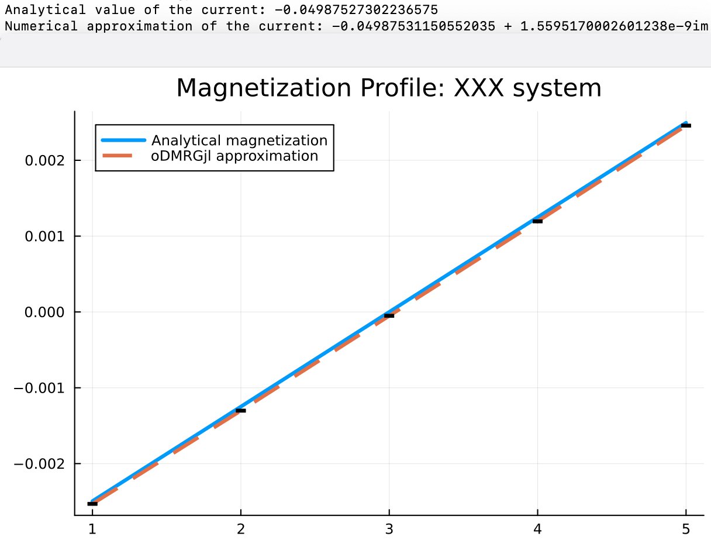

# DMRGjl 

[](https://doi.org/10.1016/j.cpc.2021.108060)
[](https://arxiv.org/abs/2009.08200)
[](https://opensource.org/licenses/MIT)

open Density Matrix Renormalization Group optimized for dissipative systems. Now in julia

## Installation
```julia
# From GitHub
] add https://github.com/heitorc7/oDMRGjl

] add oDMRG
```

## Usage example
```julia
using ITensors, ITensorMPS, oDMRG, Statistics, Plots

L = 5; gamma = 0.1 # Physical parameters: system size and coupling factor gamma
sites = siteinds("TwoSpinHalf", L) # Create sites using customized TwoSpinHalf sites
params = (
    Jx = 1.0, Jy = 1.0, Jz = 1.0,
    dissipatorsVec = [1, L],
    dissipatorsTempValues = [1.0, 0.0],
    gammaVec = [gamma, gamma],
    hVec = zeros(L)
) # Physical Parameters: Jx, Jy, Jz, dissipators location, dissipators temperature, coupling vector, magnetic field

LdL = LdLXYZConstruct(sites, params...; maxdim=500, cutoff=1e-8) # LdL MPO constructor
rho = make_ivec(L, sites)

# Plan to do 500 passes or 'sweeps' of DMRG, setting maximum MPS internal dimensions for each sweep and maximum truncation cutoff used when adapting internal dimensions:
nsweeps = 4000
cutoff = 1E-10
maxdim = [10,20]
energy, rho = dmrg(LdL,rho; nsweeps=nsweeps, maxdim=maxdim, cutoff=cutoff)

Ivec = make_ivec(L, sites)
currents = calculate_spinFlux(Ivec, rho, sites, [1:L;])
println("Analytical value of the current: ", -fluxXXX(L, gamma))
println("Numerical approximation of the current: ", mean(currents))

analyticalMag = magnonDensityXXX(L, gamma)
magDensity = calculate_magnetization(Ivec, rho, sites)

plot([1:L;], real.(analyticalMag), linewidth=3, label = "Analytical magnetization")

# Using the imaginary part of the magnon density as  uncertainty (clearly an overestimatation)
plot!([1:L;], real.(magDensity),yerr=imag.(magDensity), linestyle=:dash, linewidth=3, title = "Magnetization Profile: XXX system", label = "oDMRGjl approximation")
gui()

# Keeps plots open
read(stdin, Char)
```
 *(Check the jupyter notebook for more compreensive and well-optimized examples`)*

## Citation
```bibtex
@article{CASAGRANDE2021108060,
title = {Analysis of a density matrix renormalization group approach for transport in open quantum systems},
journal = {Computer Physics Communications},
volume = {267},
pages = {108060},
year = {2021},
issn = {0010-4655},
doi = {https://doi.org/10.1016/j.cpc.2021.108060},
url = {https://www.sciencedirect.com/science/article/pii/S0010465521001727},
author = {Heitor P. Casagrande and Dario Poletti and Gabriel T. Landi},
keywords = {Tensor networks, Open quantum systems, Density matrix renormalization group},
abstract = {Understanding the intricate properties of one-dimensional quantum systems coupled to multiple reservoirs poses a challenge to both analytical approaches and simulation techniques. Fortunately, density matrix renormalization group-based tools, which have been widely used in the study of closed systems, have also been recently extended to the treatment of open systems. We present an implementation of such method based on state-of-the-art matrix product state (MPS) and tensor network methods, that produces accurate results for a variety of combinations of parameters. Unlike most approaches, which use the time-evolution to reach the steady-state, we focus on an algorithm that is time-independent and focuses on recasting the problem in exactly the same language as the standard Density Matrix Renormalization Group (DMRG) algorithm, initially put forward in [1]. Hence, it can be readily exported to any of the available DMRG platforms. We show that this implementation is suited for studying thermal transport in one-dimensional systems. As a case study, we focus on the XXZ quantum spin chain and benchmark our results by comparing the spin current and magnetization profiles with analytical results. We then explore beyond what can be computed analytically. Our code is freely available on github at [2].}
}
```

## Contribute
```bash
git clone https://github.com/heitorc7/oDMRGjl
] dev ./oDMRG
```
